# BookLand

## Introduction

Welcome to BookLand, a platform that facilitates the buying and selling of books, making education more accessible and affordable. BookLand connects book sellers and buyers through features like auctions, ensuring a fair and competitive marketplace.

## Required Technology:
* Front-End: HTML, CSS, Bootstrap
* Back-End: PHP, MySQL
* Back-End: PHP, MySQL
* Framework: Bootstrap 5
* IDE: Visual Studio
## Project Description
### Home
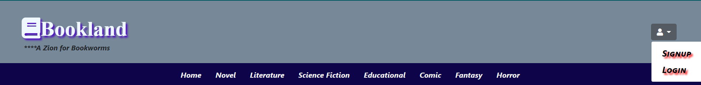
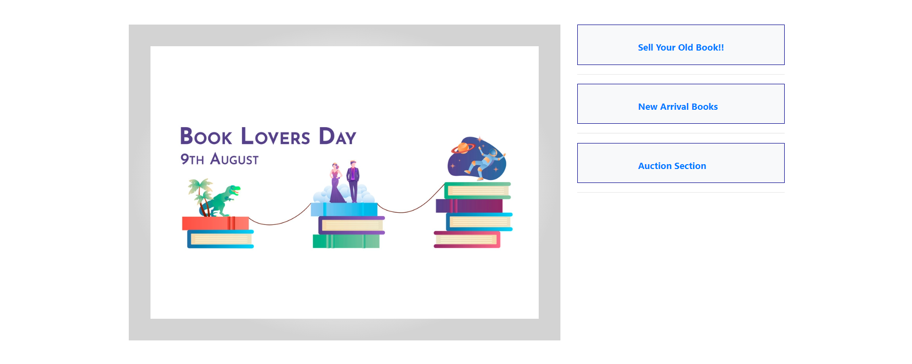
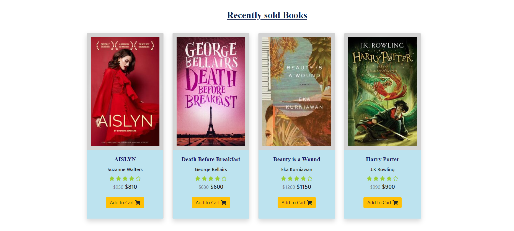

### Signup-Login

### Sell Your Old Books

- Form to describe the condition of the book for sellers.
- Collects information like book name, author, edition, tear/missing pages, initial bid, bid start/end time, and cover image.
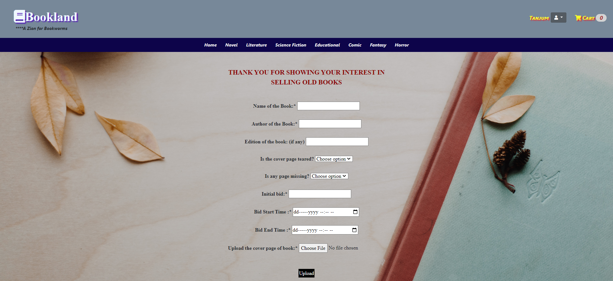

### Auction

#### For Buyers
- Full details of a book visible to buyers.
- Form for entering bidding amount.
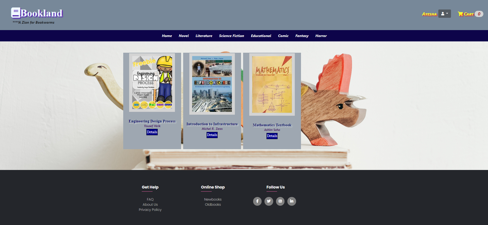
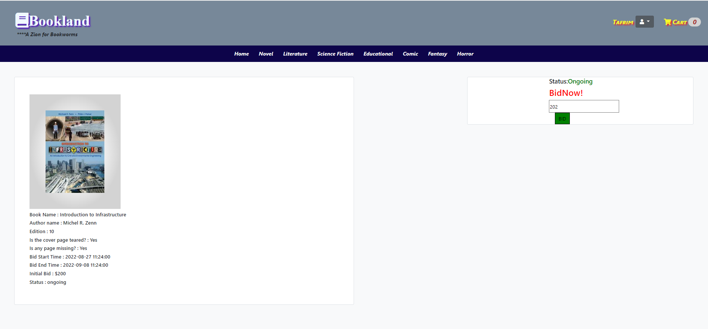

#### For Sellers
- Displays top bid, top bidder name, ID, and email.
- Sellers cannot bid on their own books.
  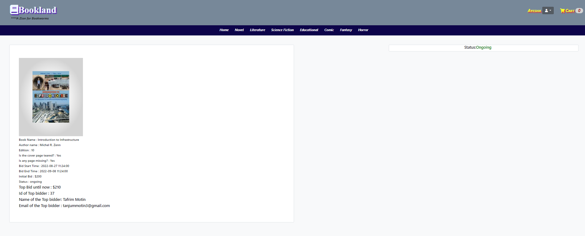

### Cart
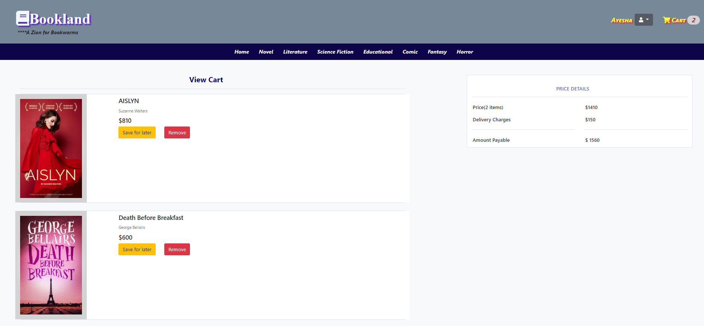
### About Us
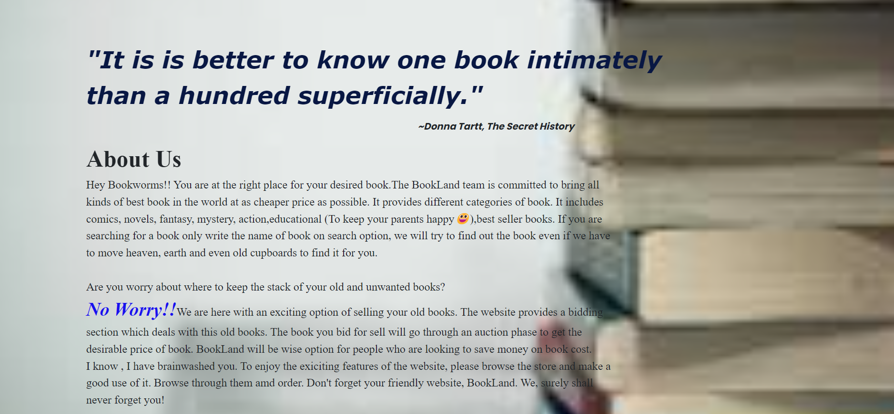

### Frequently Asked Questions

- HTML, CSS, Bootstrap, and JavaScript are used to design a page with commonly asked questions.
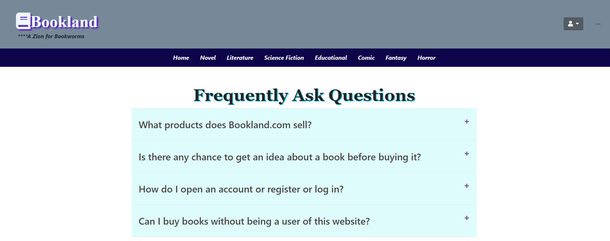

### Privacy Policy

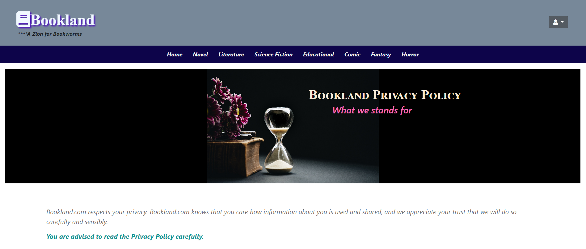

### Server Used

- Operated on the XAMPP local host server.
- Access to phpMyAdmin via MySQL admin and XAMPP Apache module for browsing.

## Testing

- Signup and login testing with various scenarios.
- Bookselling and bidding testing with validation checks.
- Cart functionality testing.

## Conclusion

BookLand aims to bridge the gap between booksellers and buyers, contributing to environmental and financial sustainability. The platform ensures a fair and secure marketplace for book lovers, making the project a vital resource for those seeking affordable and accessible books.

For More Details visit- https://drive.google.com/file/d/1xkggGApprMPDII4nlPFvMhvbEUrzmQPU/view?usp=sharing
